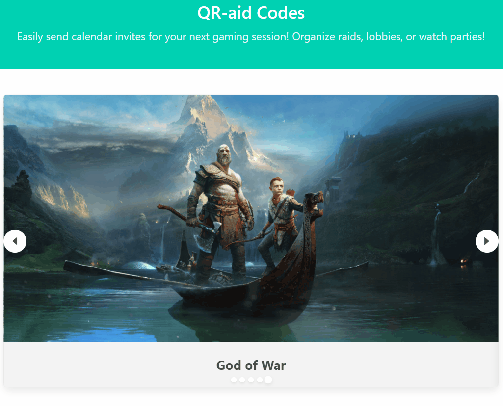

# QR-aid Codes

## Project Description

This is my personal refactor of a group project. My wonderful, original teammates can be found in [Team](#Team)

Our original repo can be found here 🙂 [QR-aid Codes](https://github.com/Diegopie/QR-aid-Codes)

For clan/group leaders to organize their play sessions

Allows them to plan and send invites across different time zones

    Invite includes:
       - Game information
       - Time of play session
       - Store information
       - Other relevant information 

Users can easily send all this information to their friend's preferred calendar application

## User Story

As a clan/group leader who wants to plan a gaming session:

I have a search bar to find my favorite games

When I find my favorite game,

* I see relevant information about it

When I want to make a play session

* I can easily set a data, time, and description of what we're playing and send that to my friends

-----

Link to the live site: [QR-aid Codes](https://diegopie.github.io/qraid-refactor)

-----

### Team

Team leader: Diego Hernandez

Team Capsule Corp. HTML/CSS: [Anastaisha Volosevych](https://github.com/volosevych), [Jordan Kirby](https://github.com/Feizhi255)

Team Planet Namek JavaScript/API: [Diego Hernandez](https://github.com/Diegopie), [Seth Martineau](https://github.com/slothings)

### Credits

Made by [Anastaisha Volosevych](https://github.com/volosevych), [Diego Hernandez](https://github.com/Diegopie), [Seth Martineau](https://github.com/slothings), and [Jordan Kirby](https://github.com/Feizhi255)

Special thanks to: [qrickit.com](https://qrickit.com/qrickit_apps/qrickit_api.php) , [rawg.io](https://rawg.io/apidocs) for our API's and for [Bulma](https://bulma.io/) for the CSS framework# qr-aid-refactor
